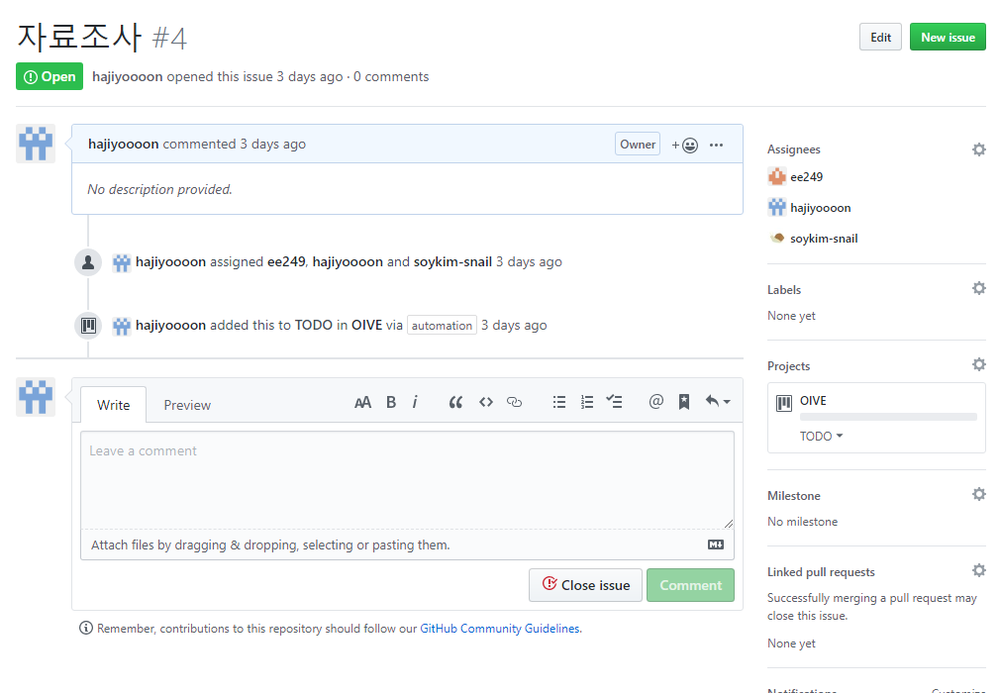
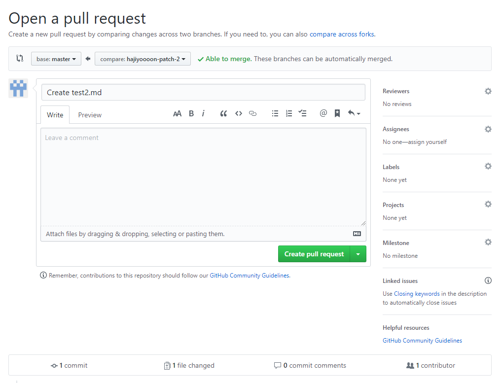
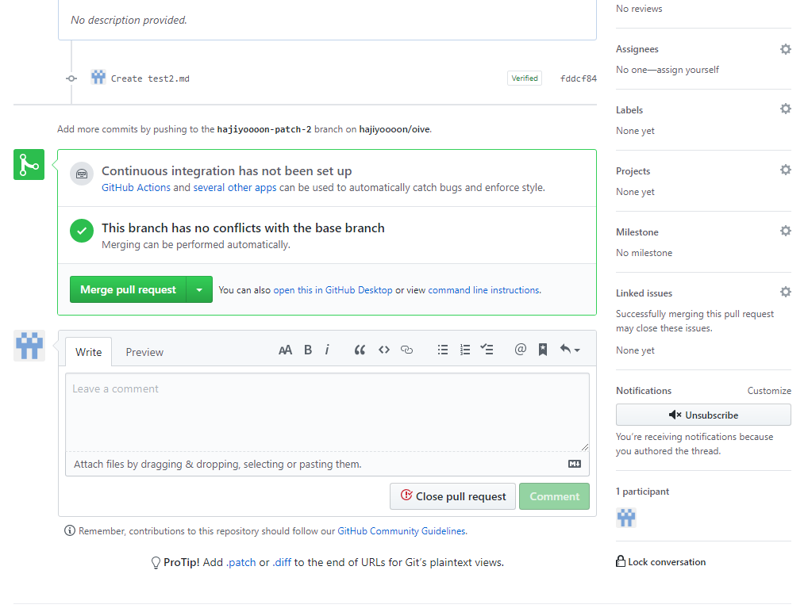

# 깃헙 프로젝트를 관리해보자!

## requirement

- 깃 & 깃헙의 존재의의에 대한 이해
- add / commit 개념 이해


## 이슈 등록

> 이슈란? 프로젝트 진행을 위해 필요한 작업 단위. 개발해야 할 기능, 수정할 기능부터 TO-DO list 까지도 이슈로 등록할 수 있음(ex. ERD 그려오기)

이슈를 등록하려면 github의 리포지토리에서 issue 탭을 클릭하고


위의 세 개를 제끼고 open a blank issue를 클릭


- title : 이슈의 이름. 프로젝트 팀원이 언제 들어도 이해할 수 있도록 요약.
- comment : 이슈를 작성한 이유 등등...
- assignees : 해당 이슈를 참고해야 할 사람들을 등록. 이메일에서 참조 기능을 생각하면 됨
- labels : 해당 이슈의 카테고리를 지정할 수 있음. 카테고리에는 기존에 등록된 카테고리도 있고, 없으면 새로 생성할 수도 있음
- projects : 본 이슈와 관련된 프로젝트를 지정. 이번에는 사용 X
- linked pull requests : 이슈와 관련된 커밋을 지정




완성된 이슈!


## branch 만들기

> 브랜치란? 다른 코드와 현재 작업 중인 코드를 분리해서 현재 작업 중인 코드를 안전하게 보관하고, 현재 작업 중인 코드에서 문제가 발생했을 때에 신속하게(?) 되돌리는 등 안정적인 코드 유지를 위해 사용

 

- 어떤 단위로 브랜치를 만들어야 할까?

기본적으로 이슈와 브랜치가 1:1 대응이 되는 것이 좋음

예 ) 이슈 #13 유저 로그인 기능 - branch 13-user_login과 같이!


- 브랜치는 어떻게 만들지?
- git bash를 이용하는 경우 다음의 명령어 입력 

```
git branch 13-user_login
git checkout 13-user_login //현재 작업 HEAD를 생성한 브랜치로 변경
```

- git desktop등 프로그램을 이용하면 훨씬 간편하게 할 수 있음


## pull requests 날리기

로컬에서 코드를 완성하면, 현재 브랜치의 내용을 github에 있는 master 브랜치와 통합하기 위해 pull request를 날려야 한다.

pull request는 말 그대로 master에게 현재 브랜치의 내용을 master의 내용과 통합해 달라고 요청하는 것인데, 따라서 현재 브랜치의 작업 내용(=이슈)가 완성되었을 때 날립시다. 만약 master에 통합할 정도로 완성되지는 않았지만, 로컬에 저장해두었다가 날릴까봐 불안할 때에는 commit만 해 두면 해당 브랜치의 내용이 깃헙에 그대로 보존됨.

- 로컬에서 작업 후 해당 브랜치를 commit한 후 깃헙 웹 사이트로 이동하면 리포지토리에 이런 알림창이 뜸. compare & pull request 클릭


- 이런 창이 뜸



- 맨 위 알림창 : merge하려는 브랜치와 현재 브랜치 간에 충돌이 없는지를 감지. 충돌이 있으면 pull request를 날릴 수 X
- reviewers : 커밋한 코드를 리뷰해 줄 팀원을 지정 가능. 
- linked issue : pull request 와 연관된 이슈를 설정할 수 있음. 이것 때문에 이슈 - 브랜치 간 1:1대응을 권장
- create pull request 클릭



저한테는 권한이 있어서 merge 버튼이 뜨는데 두 분한테는 어떤 화면이 뜰지 모르겠어요. 안뜨면 두분한테도 merge권한을 줄 수 있는 방법을 찾아보겠습니다. 아무튼 merge하면 master와 등록한 브랜치를 병합 가능


만약 이슈를 생성하고, 해당 이슈와 관련된 회의록을 작성한다면 pull request를 날리면서 관련 이슈에 등록하면 이슈를 클릭하는 것만으로 회의록까지 자동으로 확인 가능하고,

각자 ERD 등을 그려오기로 했을 때 pull request를 날리면서 관련 이슈를 등록해주면 한 눈에 모아볼 수 있어서 편리할 것 같습니다


## projects


대충 이런 기능인데 프로젝트 진행 상황을 모를 수가 없어서 사용할 필요는 없을것같아요


## Wiki


프로젝트 관련 문서를 등록할 수 있는데 지금은 등록할 게 없어서 깃헙으로 프로젝트 관리하는 법에 대해서 찾아보고 좋은 글은 링크를 걸어봤습니다

대략적으로 핵심 기능만 요약해 보았고, 저도 깃헙으로 프로젝트를 진행하는 건 처음이라 이슈와 pull request 날리는 규칙만 꼭 유지하는 걸로 하고, 나머지 규칙들은 사용해보면서(=시행착오를 겪으면서......) 추가해 나가면 될 것 같아요

감사합니다 :)

